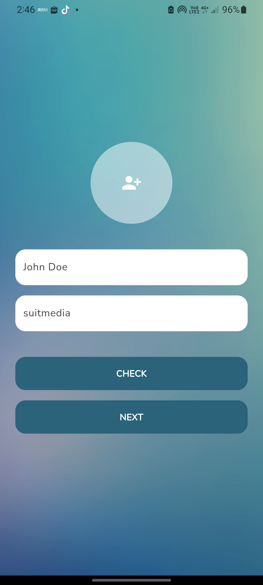
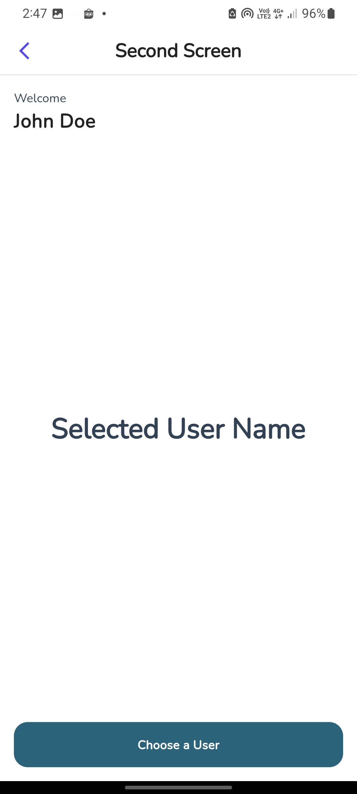
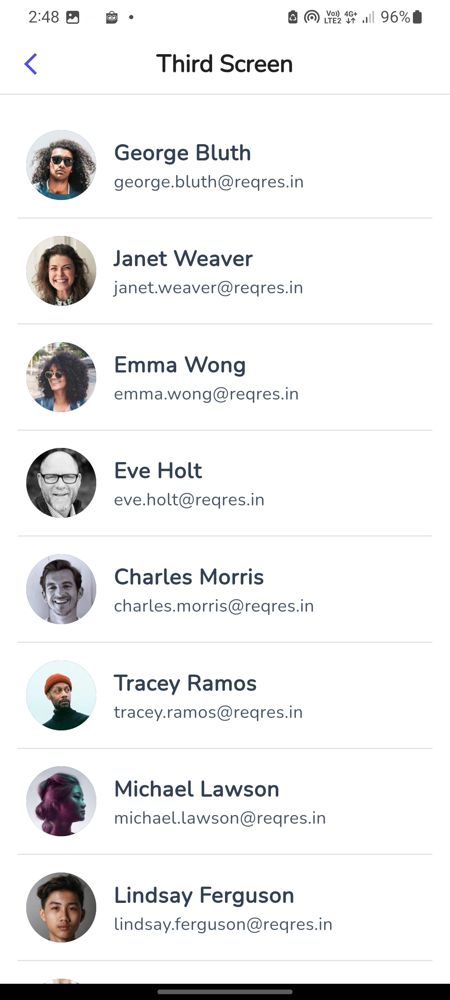

# suitmedia_test

Flutter Project for Suitmedia Test

## Screens

|  first_screen | second_screen | third_screen |
| --- | --- | --- |
|  |  |  |

## Preview

## How to Run

1. Clone this repository
2. Open the project with Android Studio or VSCode
3. Run `flutter pub get`
4. Run `flutter run`
5. Enjoy!

## Notes

You can download app-release.apk to try the app directly on your android device.

